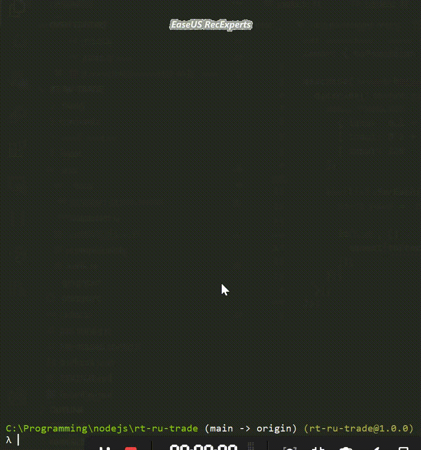
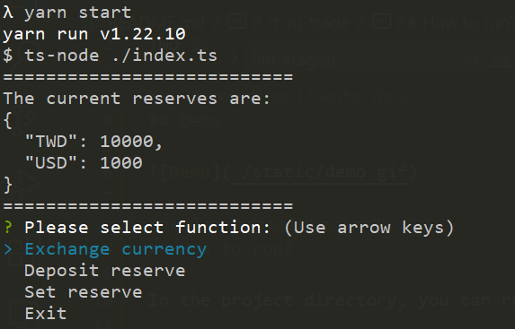
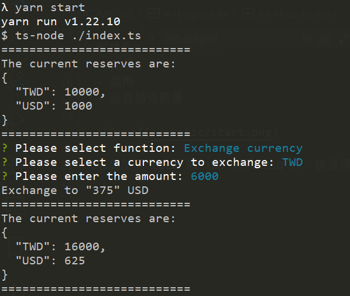
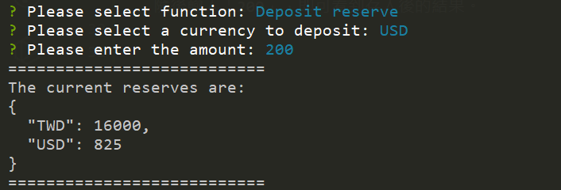
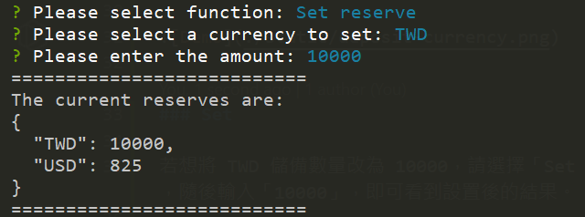

# rt-ru-trade
TWD 與 USD 的儲備數量 (TWD reserve &amp; USD reserve)

## Demo

## How to start?

In the project directory, run:

`$ yarn start`

根據你的需求選擇功能:
- 兌幣
- 儲幣
- 設置儲備數量

### Exchange currency

若想使用 6000 個 TWD 來換 USD 時，請選擇「Exchange currency」，並選擇「TWD」，隨後輸入「6000」，即可看到成功兌換的 USD 數量，以及當前儲備數量。

### Deposit

若想存 200 USD 進儲備數量，請選擇「Deposit reserve」，以及「USD」，隨後輸入「200」，即可看到存入後的結果。

### Set

若想將 TWD 儲備數量改為 10000，請選擇「Set reserve」，以及「TWD」，隨後輸入「10000」，即可看到設置後的結果。

### Exit

若想離開操作，請選擇「Exit」。

## Testing

In the project directory, run:

`$ yarn test`